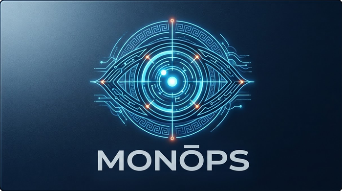

# Monops -- Entity & Research-Affiliation Screening Toolkit



**Status:** V1–V3 built; the project then moved from corpus screening to **case-based review** (`docs/requirements.md` Section 9c). The first vertical slice of **Use Case 01 — Texas HB 127 researcher screening** is built: a subject-in / worked-worksheet-and-investigative-file-out workflow that reconciles a declared affiliation set against public records (`docs/use-case-01-hb127-researcher-screening.md`, `docs/plans/2026-09-06-use-case-01-implementation.md`). The HB 127 case worksheet is the visitor-facing view; the batch pipeline stays for population re-screening. The project is named **Monops**; publicly deployed on AWS Lightsail — **[mikejennings.dev](https://mikejennings.dev)**.

## What this is not, first

This is a public, non-classified, AI-assisted-development portfolio project. It is **not**:

- a production compliance or investigative tool
- a source of confirmed findings — every match this tool produces is a scored *candidate*, never a confirmed determination
- a system covering secrecy-jurisdiction ownership (BVI/Cayman/Panama-style structures) — that's a different, deliberately out-of-scope question from the foreign-ownership/affiliation screening this project does cover

See `docs/requirements.md` Section 3 (Non-Goals) for the full statement.

## What this is

An entity-resolution and foreign-affiliation due-diligence screening toolkit, built against open datasets (NSF award data, OpenSanctions, GLEIF, Section 117 foreign gift/contract disclosures, OpenAlex bibliometric data, and others), to create an open-source experimental platform for studying the reliability, limitations and human-review requirements of cross-dataset entity resolution in research security analysis.

Built the same way as this author's other independent projects ([ed-sector-surveyor](https://github.com/jenningsmt/ed-sector-surveyor), [ed-colony-scout](https://github.com/jenningsmt/ed-colony-scout), [ed-expedition-ledger](https://github.com/jenningsmt/ed-expedition-ledger), [ring-density-monitor](https://github.com/jenningsmt/ring-density-monitor)): Python, AI-assisted ("vibe coding") development with Claude, tested, packaged, and documented for public release.

## Documentation

- [`docs/requirements.md`](docs/requirements.md) — full requirements: data sources, functional requirements (epics/stories/acceptance criteria), technology stack, storage estimates, and deployment plan.
- [`docs/architecture.md`](docs/architecture.md) — pipeline-stage breakdown and module map.
- [`docs/methodology.md`](docs/methodology.md) — how to read a run's manifest, and this version's known limitations.
- [`docs/data_sources.md`](docs/data_sources.md) — per-source license and attribution terms.
- [`docs/plans/`](docs/plans/) — the design/implementation plans reviewed and approved before each major piece was built, kept as a historical record.
- [`docs/how-this-was-built.md`](docs/how-this-was-built.md) — a running record of *how the direction happened*: where an AI collaborator's first pass needed correcting, where domain knowledge changed a technical decision, and where this project got something wrong and had to reverse it. Not a changelog — `git log` covers what changed, this covers why. Kept unedited, including the parts that aren't flattering, since those are what make the rest of it credible.

## Quickstart

Batch CLI (no server required):

```
pip install -r requirements.txt
python -m entity_screening.cli validate
python -m entity_screening.cli run \
    --nsf-file tests/fixtures/sample_nsf_awards.json \
    --opensanctions-file tests/fixtures/sample_opensanctions_targets.csv \
    --excel
pytest
```

Interactive review UI — the HB 127 case worksheet and restricted-party screening,
switchable from the sidebar (two processes; the Streamlit app is a thin client of the
API, not a direct pipeline caller):

```
uvicorn entity_screening.api.main:app --reload
streamlit run app.py   # in a second terminal — opens on the self-healing demo case
```

The app defaults to a dark theme (`.streamlit/config.toml`) so the demo presents the same
way for every visitor rather than following each one's OS light/dark preference; a visitor
can still switch via Settings → "Choose app theme". Any future demo screenshot or GIF
should be captured in the dark theme.

The demo case (`case_id="demo"`) builds itself from bundled synthetic fixtures on first
access: a fabricated subject, a structured declaration, a labelled synthetic publication
record, and a fabricated GLEIF ownership chain whose ultimate parent is named for a real
DoD Section 1260H entity — so the headline "undisclosed ultimate parent on a concern list"
finding rests on real reference data. No real declaration data is handled, ever
(`Subject`/`Declaration` reject `synthetic=False` by construction).

Or the same two services as containers (the wrapper sets `GIT_COMMIT` from
your current checkout before building, so the "Run provenance" panel in the
UI shows a real commit hash instead of null — a bare `docker compose up
--build` will silently skip that):

```
scripts\compose-up.ps1
```

## Status

**V1, V2, and V3 all built, plus the deferred VSS topic-similarity layer:** NSF
Award Search + OpenSanctions ingestion, fuzzy name/alias resolution,
entity-of-concern screening against both OpenSanctions and DoD's Section 1260H
list, a GLEIF-backed ownership graph with foreign-control (parent-jurisdiction)
flagging, a Section 117 foreign gift/contract disclosure cross-check, an OpenAlex
bibliometric co-authorship/affiliation layer with PI disambiguation (the Seven Sons
universities are covered via the existing OpenSanctions data, not a dedicated list
— see `docs/data_sources.md`), a semantic topic-similarity layer that ranks PIs'
real papers against real DoD/CET critical-technology reference corpora (advisory
only, never a scored match — needs `requirements-vss.txt` installed, not part of
the base install), an editable-weight scoring rubric, CSV/Excel export with a
reproducibility manifest, a FastAPI layer over the pipeline with a Streamlit UI as
its thin client, CI (GitHub Actions, including a real Docker Compose integration
job), a two-container Docker Compose setup (API + UI), and a pytest suite including
a known-difficult-entity regression set. Epic J (LLM-based evidence-grounded
explanations, built 2026-09-15) adds one citation-grounded, lexicon-checked
synthesis sentence per case-worksheet finding/tie — everything else in an
explanation stays fully templated.
